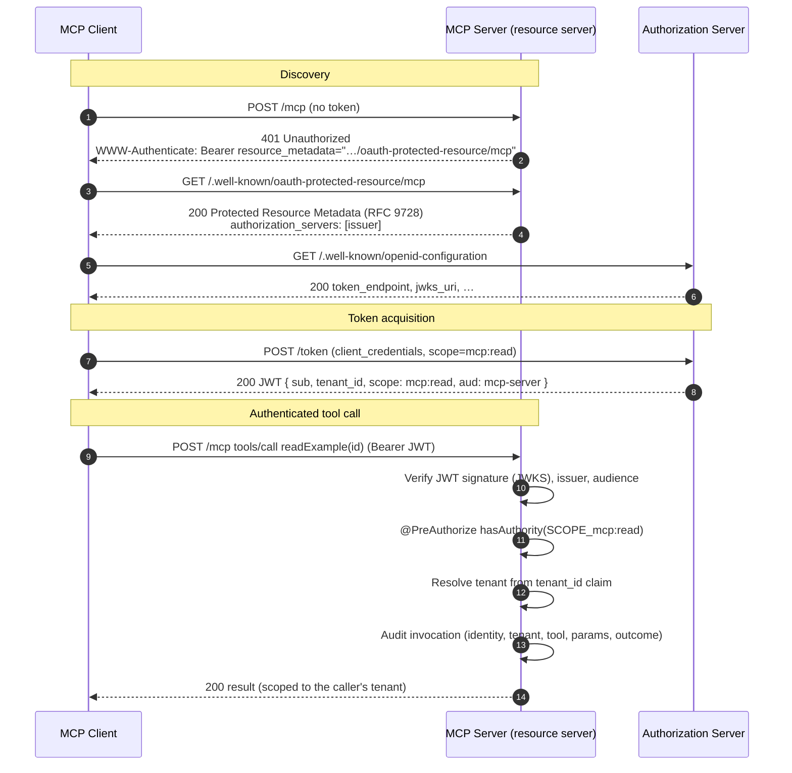

# Authentication flow

How an MCP client discovers the authorization server, obtains a token, and makes an
authenticated, scope-checked, tenant-scoped tool call against this server.

Notes:

- The MCP server publishes **two** discovery documents (the spec changed mid-revision):
  Protected Resource Metadata (RFC 9728) at `/.well-known/oauth-protected-resource/mcp`,
  and Authorization Server Metadata (RFC 8414) at `/.well-known/oauth-authorization-server`.
- Signature validity alone is not sufficient — the server also checks `iss` and `aud`.
- Authorization is per tool (`@PreAuthorize` on the scope) and per tenant (the `tenant_id`
  claim scopes all data access); both rely on the `SecurityContext` being propagated into
  the tool's worker thread.
- A token carrying only `mcp:read` is denied the write tool.
