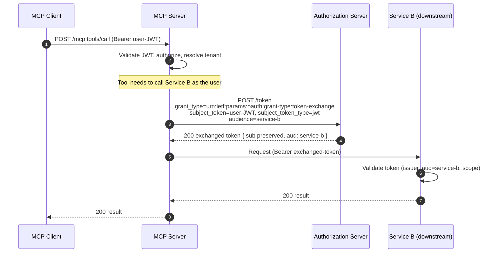

# Token exchange flow (RFC 8693)

How an authenticated identity travels to a downstream service without credential re-entry.
The MCP server exchanges the caller's JWT for a token scoped to "service B", preserving the
original user identity (cascading delegation).

Notes:

- The caller's JWT is sent as the **`subject_token`**; the authorization server mints a new
  token whose `sub` still identifies the original user — delegation, not impersonation.
- Spring does not send an `audience` on a token exchange by default; this server adds it so
  Service B's resource server accepts the token (`aud = service-b`).
- The exchange is performed by `TokenExchangeService` using Spring Security's
  `TokenExchangeOAuth2AuthorizedClientProvider`; no user credentials are re-entered.
